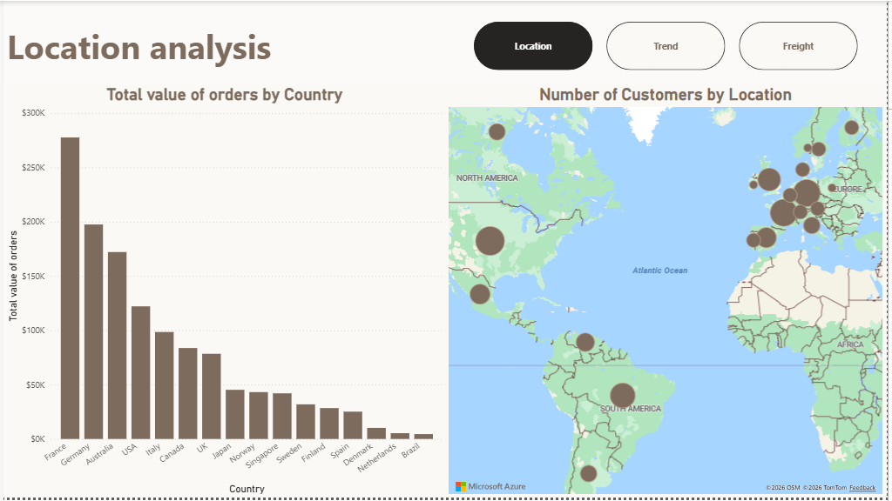
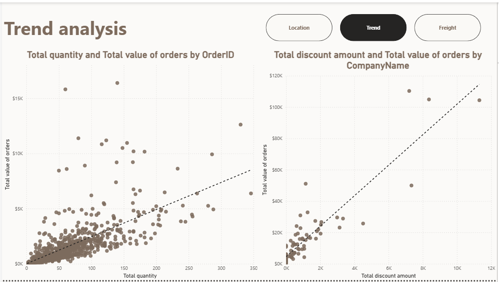
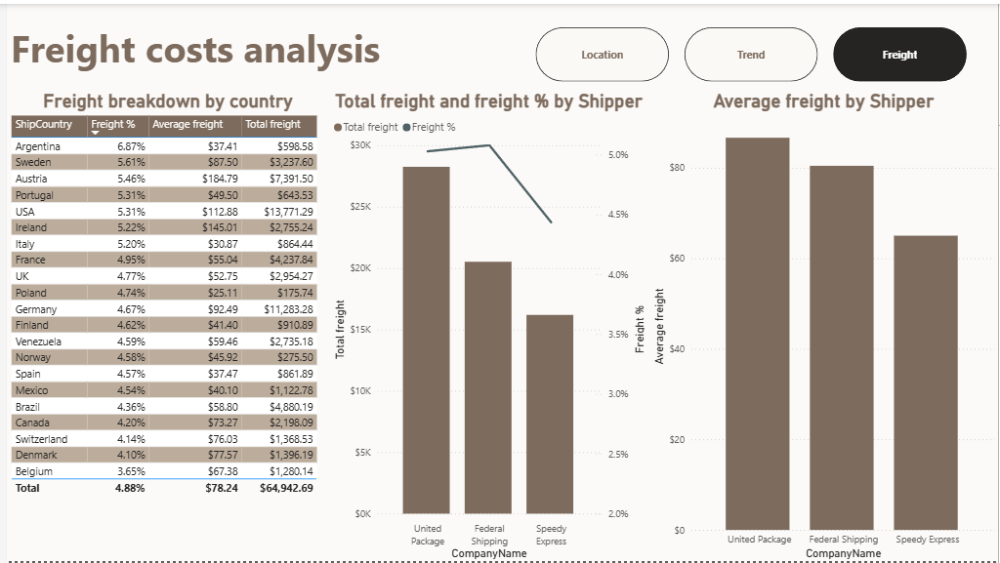
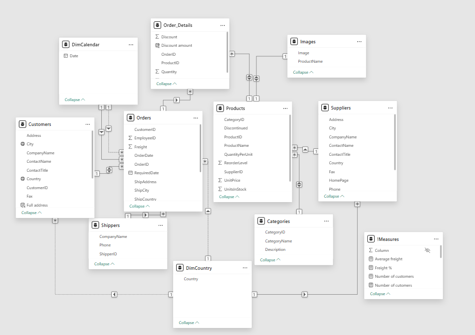

# Data Analysis: Northwind (Power BI Dashboard)

## Project Description
This project is an interactive analytical dashboard created in Microsoft Power BI. It is based on the popular sample database, Northwind Traders, which simulates the operations of a specialty foods wholesale and distribution company.

The objective of this dashboard is to transform raw sales data into actionable insights, utilizing a clean, modern interface with custom navigation to explore sales overviews, product performance, and freight.

## Preview (Screenshots)

This visualization shows two important correlations. First: more orders from a client means bigger total value of orders - clients come back and they usually stay loyal. Second: the more discount clients get, the more they spend

## Technologies and Skills
In this project, I used the following tools and techniques:
- **Main tool:** Microsoft Power BI Desktop
- **Data transformation (ETL):** Power Query
- **Calculations:** DAX (Data Analysis Expressions) for creating measures and calculated columns
- **Model** Snowflake schema
- **Data source:** https://services.odata.org/V3/Northwind/Northwind.svc/

## How to run the project locally
1. Download or clone this repository to your local machine.
2. Download the `Northwind.pbix` file.
3. To open the file, you need the free [Microsoft Power BI Desktop](https://powerbi.microsoft.com/desktop/) software.
4. Run the file to interactively filter data and explore the visualizations.